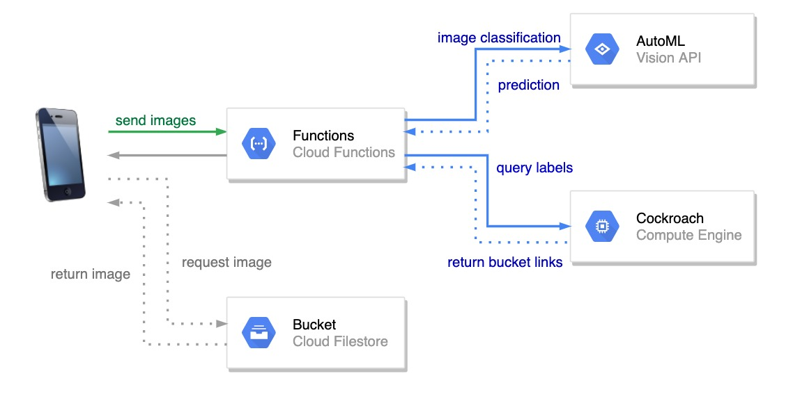

## Architecture

We use GCP as our backend cloud server, including Function, AutoML Vision, Bucket Storage and Compute Engine (host of cockroach instance).
Here is the illustration of our backend architecture.


## Endpoints

We open up several endpoints on GCP functions to handle the tasks of image classification and query database.

Accept post request which contains base64 encoding images as string in request.body.image:
```
https://us-central1-what2cook-301906.cloudfunctions.net/Predict
```

Accept post request which takes the bucket id and return corresponding images from GCP bucket:
```
https://us-central1-what2cook-301906.cloudfunctions.net/FetchImage
```

Health check:
```
https://us-central1-what2cook-301906.cloudfunctions.net/What2CookFunction
```

## Multi-label Image Classification

We use Google AutoML Vision to enpower and train our multi-label image classifier. The dataset used to trained the model refers to a Kaggle open source dataset [Fruit and Vegetable Image Recognition](https://www.kaggle.com/kritikseth/fruit-and-vegetable-image-recognition). Besides, we also create our own training dataset as an extension to receive better performance (accuracy).


## Workflow

Mobile will call **Predict** and feed in the user input image, which will trigger the image classification task and return the prediction of the ingredients that the user has captured. Then the server will perform query on cockroach and return our recommended dishes according to the available ingredients. The server will return the result as well as the bucket id of the image of the dishes to the cell phone. Afterwards, the cell phone will send another http request to the server to query the bucket ids of the dish images on gcp. The returned images will be displayed on the app as references.

## Deployment

Please ensure that you have been granted the access to deploy the services. Authentication may be required.

Run deployment on local
```
./run.sh function_name local
```

Run deployment on gcp
```
./run.sh function_name deploy
```

Run trival test on local
```
./run.sh Test local
```