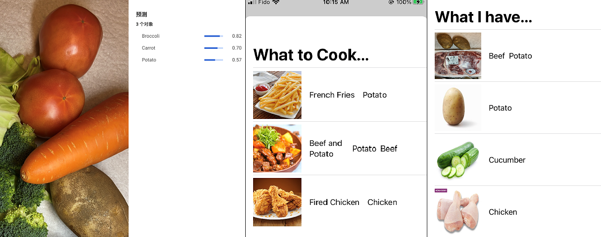

# What2Cook

## Introduction ##
Terminator of food decidophobia

## Inspiration ##
What needs or challenges do we have?
During the pandemic, we usually buy lots of materials from the supermarket and keey them into the refrigerator. Sometimes, when we open the door of the refrigerator, we lost of mind what should we cook today. Our idea is to develop an application which can easily require an idea by uploading the pictures from photo gallery or taking several images through the camera right away. 

## What it does ##
1. Accept pictures from photo gallery or take one through the camera.
2. Pictures would send to Google's Auto-ML and classify the materials in the picture.
3. Users check if each material is correctly classified.
4. Hit "What 2 Cook" button, the application would come up with food ideas!

## How we built it ##
For the iOS client, we used Swift programming language and SwiftUI framework. We adopted many modern techniques like functional programming, declarative programming and reactive programming for the client application. To keep the app as simple as possible, we used many vanila iOS UI elements.

For db, we design an relieble database schema firstly. The knowledge we gained from the university and cockroachDB technique strongly helps us to build a powerful database. We prepare two plans to deploy the database: deploying on the Google Cloud Platform or in the local machnie.

For server, we use node.js to build a service which would accept the request from the client and return the best recommendation to the user.

For ML, we use Google AutoML Vision V1, which support building and training of multi-label classification task. The model was deployed on GCP and the returned prediction is fetched by GCP function and then delivered to the mobile phone.

## Challenges we ran into ##
This is our first time to use Swift programming language and Swift UI framework to develop IOS application. We have to build and learn at the same time. In addition, SwiftUI is a relatively new framework and there are limited reousrces and tutorials online about it. This brings a lot of hardness to us. It is also the first time for us to use cockroachDB as well. Luckily, we have experience with MySQL before. During the development, the cockroach cloud free-tier shut down which heavily resists our process. We prepare two alternatives for the server and database deployment. The one is deploying the cockroach instance and server in the local machine, and the second plan is putting the cockroach instance and server to the Google Cloud Platform. Especially, we deploy to the cockroach instance into VM instance with docker image on Google Compute Engine. As for the machine learning task, we trained our multi-label classifier on Google AutoML. The biggest challenge here is looking for the dataset. There are some open source dataset available which are relvent to our classification task, but nono of them can well represent the distribution of our input data that is the ingredient. We decided to use one dataset provided by kaggle and extended by adding our own dataset. It is extremely time-consuming to capture the images and add labels. The final performance of our model reaches really good accuracy rate (86%) with those contributions of our own data.

## What we learned ##
1. iOS + Swift development.
2. Distributed SQL database.
3. DevOps skills.
4. Machine learning experience.
5. Teamwork.

## Next steps for What2Cook ##
What we plan to do post-HacktheNorth?
1. Voice Input (Cross-platform via Voiceflow API on Alexa)
2. Contributing food ideas by uploading photo and classify materials in the photo. 
3. Each of material would show the amount of needed for each food. (e.g.) jumbo shrimp: 1 pound + 1 pound broccoli.
4. Calculate and display approximate calories of each food. Recommendation would based on pre-setting value by users
5. Authentication on the server and clinet connections (e.g OAUTH2).