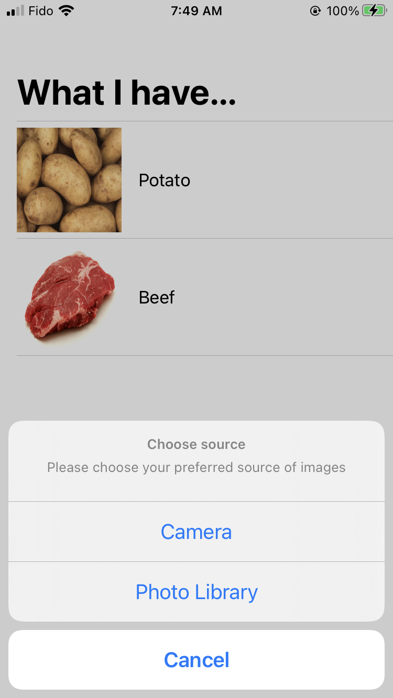
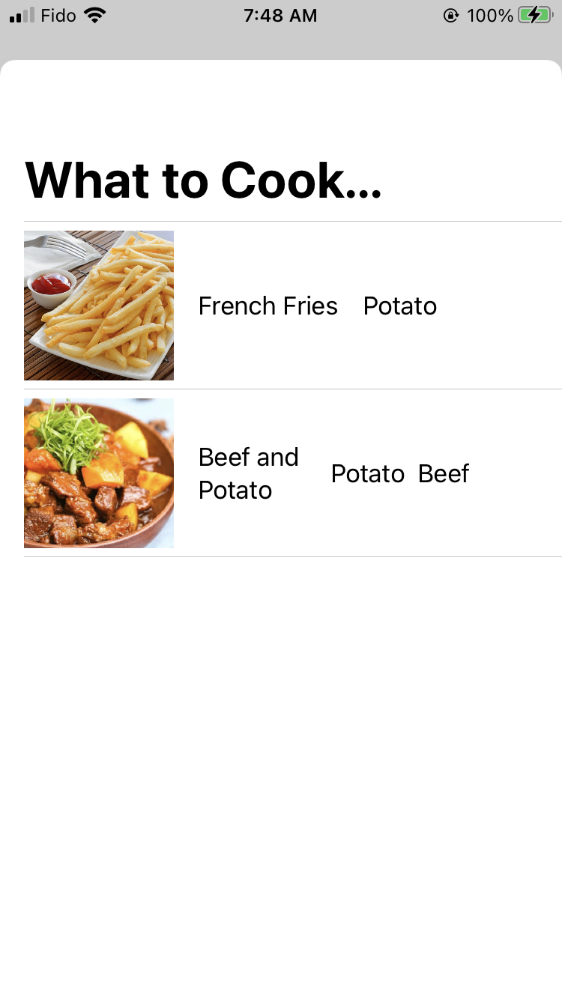

# iOS Client App

Choose pictures from the photo library or take a new one.

The client will send the pictures to the server which will return the materials in the image.

Then, the client can send the materials to the server to get recommendations of meals.

